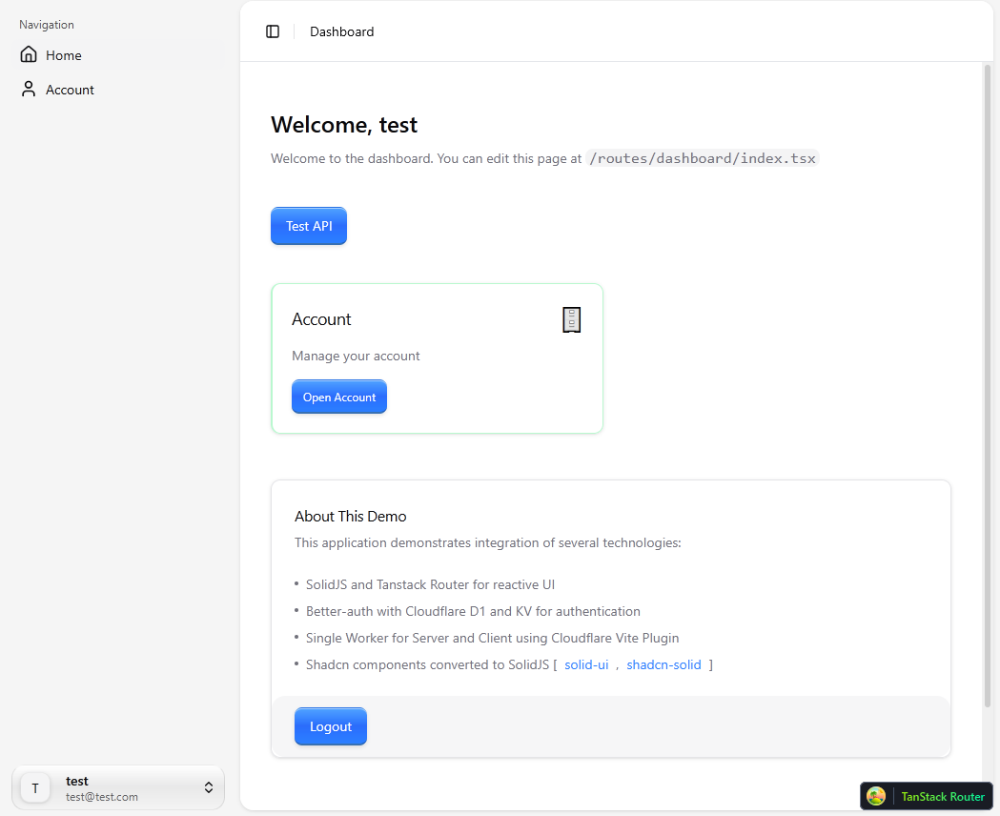
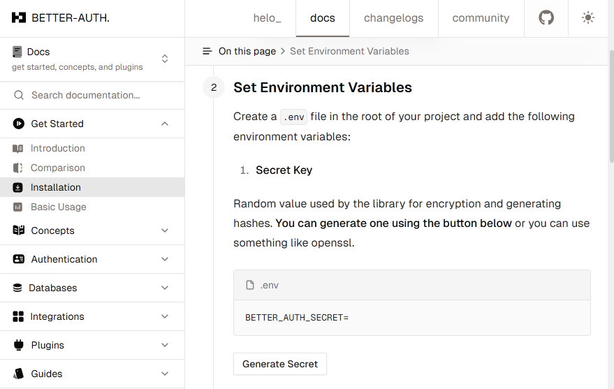
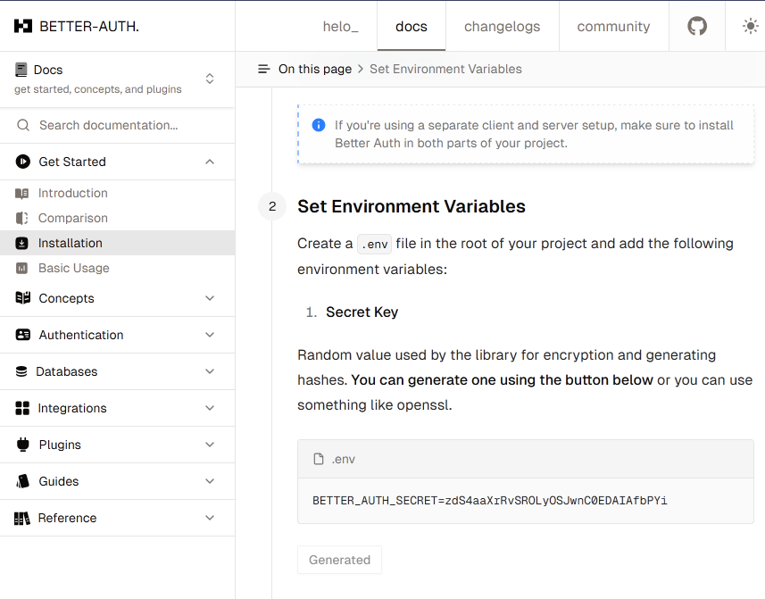
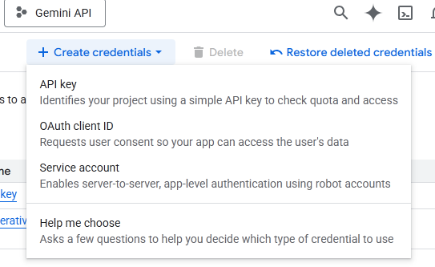
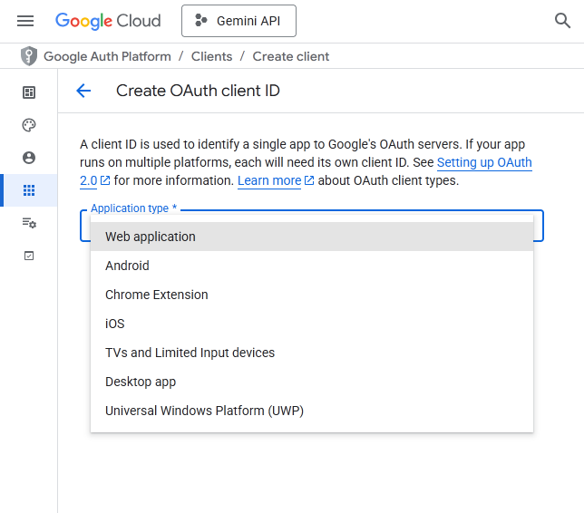
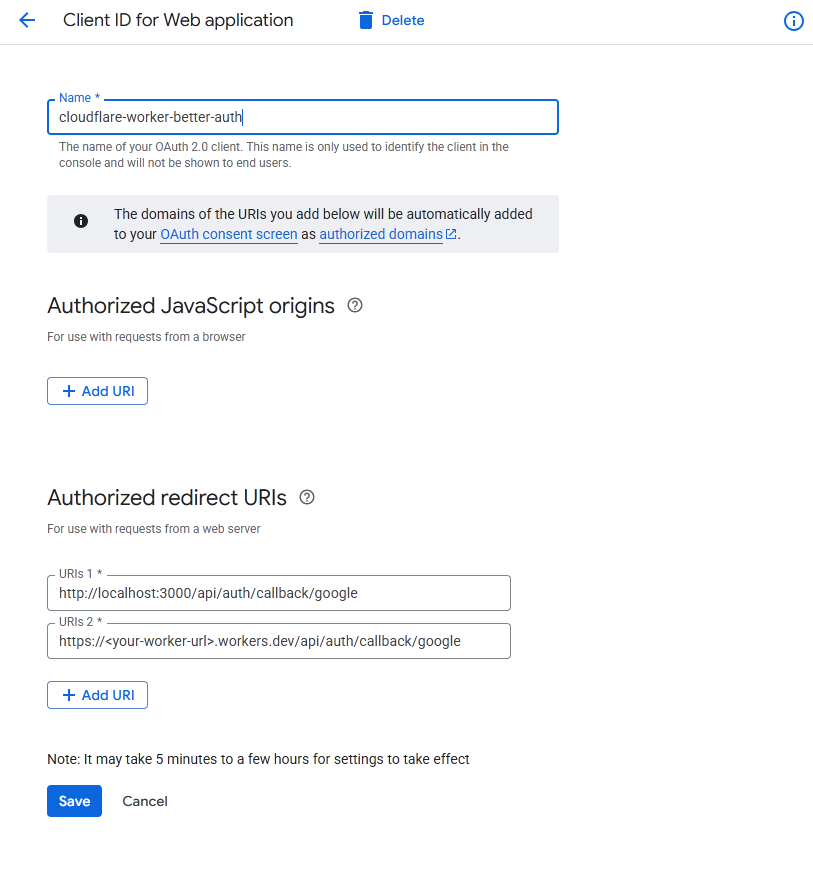
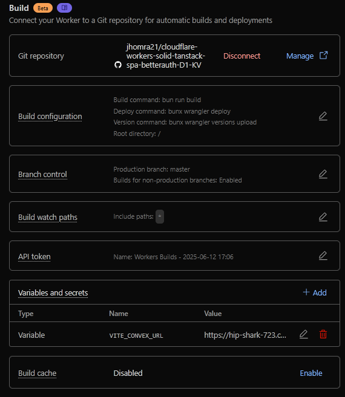
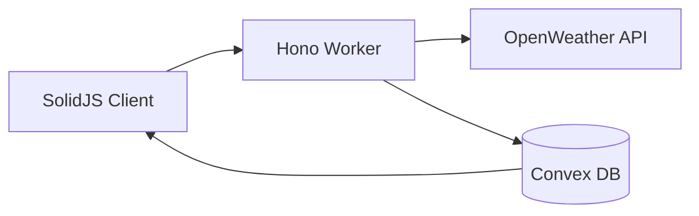

# Cloudflare Workers Vite Plugin + Vite + SolidJS and Tanstack Router + Hono + Better Auth + Convex
[](https://github.com/jhomra21/cloudflare-workers-solid-tanstack-spa-betterauth-D1-KV/actions/workflows/test.yml)

> [!NOTE]
> 🚀 **Live Demo:** Check out the deployed application here: **[test-workers-solid-tanstack-spa-betterauth-d1-kv.jhonra121.workers.dev](https://test-workers-solid-tanstack-spa-betterauth-d1-kv.jhonra121.workers.dev/)**

[](https://deploy.workers.cloudflare.com/?url=https://github.com/jhomra21/cloudflare-workers-solid-tanstack-spa-betterauth-D1-KV)

> [!IMPORTANT]
> After deploying with the button above, you must perform several crucial setup steps to make the application fully functional. Please follow our detailed **[Post-Deployment Setup Guide](#-post-deployment-setup-guide-for-deploy-to-cloudflare-users)** below.

A comprehensive template for building modern web applications using SolidJS on the frontend and a Cloudflare-powered backend. This template integrates Better Auth for authentication, Cloudflare D1 for database storage, Cloudflare Workers for serverless APIs, and Cloudflare KV for session management.

## 🌟 Core Features
- **SolidJS Frontend**: Reactive UI with TanStack Router for file-based routing and TanStack Query for server state management.
- **Hono.js API**: Lightweight, fast API layer running on Cloudflare Workers.
- **🔐 Robust Authentication**: Secure system using `better-auth` with Google OAuth and email/password support.
- **Cloudflare Stack**: Leverages Cloudflare D1, KV, and Workers for a scalable and performant infrastructure.
- **🔄 Convex Integration**: Real-time database with custom SolidJS hooks, built-in loading states, and comprehensive error handling.
---

## ✨ Application Preview



## 🚀 Getting Started (For Local Development)

This guide is for developers who want to clone the repository and run the project on their local machine first.

### 1. Initial Cloudflare Setup
[Cloudflare Wrangler D1 Commands Documentation](https://developers.cloudflare.com/workers/wrangler/commands/#d1)

Before you can run the application, you need a Cloudflare D1 database and a KV namespace.

#### Create the D1 Database
Run the following command to create your D1 database. Replace `<YOUR_DB_NAME>` with a name of your choice (e.g., `my-app-db`).

```bash
bunx wrangler d1 create <YOUR_DB_NAME>
```

Cloudflare will return a configuration block. Copy this and add it to the `d1_databases` array in your `wrangler.jsonc` file. It will look like this:

```jsonc
// wrangler.jsonc
{
  // ... other configurations
  "d1_databases": [
    {
      "binding": "DB", 
      "database_name": "<YOUR_DB_NAME>",
      "database_id": "<your-database-id>"
    }
  ]
}
```
Copy the output configuration and add it to the `d1_databases` array in your `wrangler.jsonc` file.

> [!IMPORTANT]
> The `binding` name must be `"DB"` as this is what the application code expects.

#### Create the KV Namespace
```bash
bunx wrangler kv namespace create "SESSION_KV"
```
Copy the output and add it to the `kv_namespaces` array in `wrangler.jsonc`.

This command will also return a configuration block. Add it to the `kv_namespaces` array in `wrangler.jsonc`.

```jsonc
// wrangler.jsonc
{
  // ... other configurations
  "kv_namespaces": [
    {
      "binding": "SESSIONS", 
      "id": "<your-namespace-id>",
      "preview_id": "<your-namespace-preview-id>"
    }
  ]
}
```
> [!IMPORTANT]
> The `binding` name must be `"SESSIONS"` as this is what the application code expects.

### 2. Database Migrations (D1)

To set up your local D1 database, apply the initial migration from the `migrations/` folder.
```bash
bunx wrangler d1 migrations apply <YOUR_DB_NAME> --local
```

### 3. Environment Variables & Secrets
[Cloudflare Wrangler: Managing Secrets](https://developers.cloudflare.com/workers/wrangler/commands/#secret)

Your application requires secrets and environment variables to function.

#### Local Development (`.dev.vars`)

1.  **Create your variables file**: Copy `example.dev.vars` and rename it to `.dev.vars`.
    ```bash
    cp example.dev.vars .dev.vars
    ```

2.  **Generate `BETTER_AUTH_SECRET`**: See the [**`BETTER_AUTH_SECRET` Generation Guide**](#better-auth-secret) below for instructions. Once you have the secret, paste it into your `.dev.vars` file.

3.  **Add Google Credentials**: See the [**Google OAuth Credentials Guide**](#google-oauth-credentials) below to get your `GOOGLE_CLIENT_ID` and `GOOGLE_CLIENT_SECRET`, then paste them into `.dev.vars`.

> [!WARNING]
> **Never commit `.dev.vars` to version control.** The file is already listed in `.gitignore`.

#### Production (Cloudflare)

1.  **Set Secrets**: You will need values for `BETTER_AUTH_SECRET`, `GOOGLE_CLIENT_ID`, and `GOOGLE_CLIENT_SECRET`. See the [**Generating Credentials**](#-generating-credentials) section below for instructions on how to get these. Then, add them to Cloudflare using Wrangler:
    ```bash
    bunx wrangler secret put BETTER_AUTH_SECRET
    bunx wrangler secret put GOOGLE_CLIENT_ID
    bunx wrangler secret put GOOGLE_CLIENT_SECRET
    ```

---

## 🚀 Post-Deployment Setup Guide (For "Deploy to Cloudflare" Users)

Welcome! If you've just deployed this project using the button, these next steps are **required** to get your application fully working.

### Step 1: Configure Environment & Secrets

Your app needs secret keys for authentication and a URL to point to itself. You can set these from the Cloudflare dashboard without needing a terminal.

1.  In the Cloudflare dashboard, go to **Workers & Pages** and select your **New Project**.
2.  Navigate to **Settings** > **Variables**.
3.  Under **Environment Variables**, add the following:
    *   `BETTER_AUTH_URL`: 
        *   **Value**: Enter the full URL of your worker (e.g., `https://<your-project>.<your-account>.workers.dev`).
        *   This one is **not** a secret, so do not encrypt it.
    > [!IMPORTANT]
    > Make sure to save as 'Secret' and not 'Text' for these:
    *   `BETTER_AUTH_SECRET`: 
        *   **Value**: Follow the [**`BETTER_AUTH_SECRET` Generation Guide**](#better-auth-secret) below to generate a secret, then paste it here.
        *   Click the **Encrypt** button to keep it secure.
    *   `GOOGLE_CLIENT_ID` & `GOOGLE_CLIENT_SECRET`:
        *   **Value**: Follow the [**Google OAuth Credentials Guide**](#google-oauth-credentials) below to get your credentials, then paste them here.
        *   Click **Encrypt** for both of these as well.

### Step 2: Run the Database Migration

The deploy button creates your D1 database, but it doesn't create the necessary tables for users and sessions.

#### Method A: Using the Cloudflare Dashboard (No Terminal Needed)

This is the easiest way to set up your database schema.

1.  First, you need the SQL commands. Go to the migration file in the project's GitHub repository: [`migrations/0000_initial.sql`](https://github.com/jhomra21/cloudflare-workers-solid-tanstack-spa-betterauth-D1-KV/blob/master/migrations/0000_initial.sql).
2.  Copy the entire content of that file.
3.  In your Cloudflare Dashboard, navigate to **D1** from the left-hand menu.
4.  Select the database that was created for your project. It will likely have a name similar to your project name.
5.  Click on the **Console** tab.
6.  Paste the copied SQL commands into the query box and click **Run**.

#### Method B: Using the Command Line (Requires Git & Wrangler)

If you're comfortable with the command line:

1.  **Clone your new repository** from GitHub to your local machine.
2.  **Navigate into the project directory**.
3.  **Run the migration command**, replacing `<YOUR_DB_NAME>` with the name of the D1 database created during deployment (you can find this in your Cloudflare dashboard).
    ```bash
    bunx wrangler d1 migrations apply <YOUR_DB_NAME> --remote
    ```

**Your application should now be fully configured and ready to use!**

---

## 🔑 Generating Credentials

This section details how to get the required secrets for the application to run.

### Better Auth Secret

This is a random, secret key used by the `better-auth` library for encryption.

1.  Navigate to the [Better Auth documentation](https://www.better-auth.com/docs/installation#set-environment-variables) and use their built-in generator.
    
2.  Copy the generated secret.
    

### Google OAuth Credentials

To enable Google Sign-In for your application, you need to create OAuth 2.0 credentials in the Google Cloud Console. Follow these steps to get your Client ID and Client Secret.

1.  Navigate to the [APIs & Services > Credentials](https://console.cloud.google.com/apis/credentials) page in your Google Cloud project. Click on **+ Create credentials**.
    

2.  From the dropdown menu, select **OAuth client ID**. For the **Application type**, choose **Web application**.
    

3.  Configure your OAuth client ID:
    *   Give it a descriptive **Name** (e.g., "Cloudflare Worker Auth").
    *   Under **Authorized redirect URIs**, you must add the callback URLs for both your local development environment and your deployed application.
        *   For local development: `http://localhost:3000/api/auth/callback/google`
        *   For production: `https://<YOUR_WORKER_URL>/api/auth/callback/google` (replace `<YOUR_WORKER_URL>` with your actual worker's URL).
    

4.  Click **Save**. Google will provide you with a **Client ID** and a **Client Secret**.

5.  You must add these values as secrets for your project, either in your `.dev.vars` file for local development or in the Cloudflare Dashboard for production.

> [!NOTE]
> **After adding new environment vars or secrets, you must redeploy your worker. Either via dashboard or git**

---

## 🔧 Technical Deep Dive
The template uses [Vite](https://vitejs.dev/), [Solid-js](https://www.solidjs.com/), [Tanstack Solid Router](https://tanstack.com/router/v1/docs/adapters/solid-router), [Better-auth](https://better-auth.dev/), and [Cloudflare](https://www.cloudflare.com/).

### Database & API Architecture
This project uses a Cloudflare-centric database strategy:

- **Cloudflare D1** (SQLite): Centralized storage for authentication data (users, accounts, etc.) and application data.
- **Cloudflare KV**: Utilized for session storage, enabling fast edge validation of user sessions.
- **Convex**: Real-time database and backend application platform for managing application data like tasks.

The backend API is built with **Hono.js** and runs on Cloudflare Workers, providing a lightweight and high-performance serverless foundation.

### Client-Side Authentication & State Management
User authentication state on the client is managed by TanStack Query, providing a robust, cacheable, and reactive "source of truth" for the user's session.

-   **API Client**: The `better-auth/client` library, initialized in `src/lib/auth-client.ts`, handles the low-level communication with the backend authentication API.
-   **Session Caching**: A global query with the key `['session']` is responsible for fetching and caching the user's session data. This is defined in `src/lib/auth-guard.ts` within `sessionQueryOptions`.
-   **Authentication Actions**: Custom mutation hooks in `src/lib/auth-actions.ts` (e.g., `useSignInMutation`, `useSignUpMutation`) wrap `authClient` methods. They leverage TanStack Mutation to handle the entire lifecycle of an auth action—submitting data, updating cache on success, and handling errors.
-   **Route Protection**: TanStack Router's `loader` functions are used to protect routes. The `protectedLoader` in `src/lib/auth-guard.ts` ensures that a valid session exists before rendering a protected route, redirecting to `/auth` if not.
-   **Sign-Out**: The `useSignOutMutation` hook orchestrates the sign-out process. It calls the auth client, and upon success, immediately clears the `['session']` from the query cache for a snappy UI update before redirecting the user.

This setup decouples UI components like `src/routes/auth.tsx` and `src/components/nav-user.tsx` from the underlying API logic, allowing them to simply use these dedicated hooks and the `['session']` query to manage and display authentication state.

>[!IMPORTANT]
> ### Custom Authentication Hashing for Cloudflare Workers
>
-   A critical consideration when deploying to Cloudflare Workers, especially on the free plan, is CPU time limitations. The default password hashing and verification functions provided by `better-auth` are computationally intensive by design to maximize security. However, this can lead to exceeding the CPU time limits on the free tier, resulting in `503` errors during sign-up or sign-in.

-   To mitigate this, this template provides custom `hashPassword` and `verifyPassword` functions within `auth.ts`. These functions use `scrypt` from `node:crypto` with parameters tuned to provide compatibility and security while remaining within the CPU constraints of the Cloudflare Workers free plan. This ensures that email and password authentication remains reliable without causing server timeouts.

### OAuth Callback Handling in Development

> [!NOTE]
> **The OAuth SPA Problem**
> When using a Single-Page Application (SPA) framework like SolidJS with Cloudflare Pages and the Vite plugin, a specific challenge arises with OAuth callbacks (e.g., from Google Sign-In) in the local development environment. Cloudflare's SPA routing intercepts the callback (e.g., to `/api/auth/callback/google`) and serves the `index.html` instead of passing the request to your backend Hono worker. This prevents the server-side authentication from completing.

**The Solution:**

The solution is to embrace this SPA behavior by creating a dedicated client-side route to handle the callback.

1.  **Create a specific route** in your client-side router (e.g., TanStack Router) that matches the callback path.
2.  **The component for this route** has a single responsibility: to immediately make a `fetch` request to the *exact same URL* it's currently on (`window.location.href`).
3.  **This `fetch` request is the key.** Unlike the initial browser navigation, a `fetch` is an API request. The Vite server and the Cloudflare plugin correctly route this `fetch` request to your backend Hono worker.
4.  The backend worker then processes the OAuth code, creates a session, and responds to the `fetch` call.
5.  Upon receiving a successful response, the component uses the client-side router's `navigate` function to redirect the user to their intended destination (e.g., `/dashboard`).

This approach creates a seamless "shim" within your client application that correctly bridges the OAuth redirect and your backend API, working in harmony with the SPA development server.

## 🗝 Setting up Google OAuth Credentials

To enable Google Sign-In for your application, you need to create OAuth 2.0 credentials in the Google Cloud Console. Follow these steps to get your Client ID and Client Secret.

1.  Navigate to the [APIs & Services > Credentials](https://console.cloud.google.com/apis/credentials) page in your Google Cloud project. Click on **+ Create credentials**.
    

2.  From the dropdown menu, select **OAuth client ID**. For the **Application type**, choose **Web application**.
    

3.  Configure your OAuth client ID:
    *   Give it a descriptive **Name** (e.g., "Cloudflare Worker Auth").
    *   Under **Authorized redirect URIs**, you must add the callback URLs for both your local development environment and your deployed application.
        *   For local development: `http://localhost:3000/api/auth/callback/google`
        *   For production: `https://<YOUR_WORKER_URL>/api/auth/callback/google` (replace `<YOUR_WORKER_URL>` with your actual worker's URL).
    

4.  Click **Save**. Google will provide you with a **Client ID** and a **Client Secret**.

5.  You must add these values as secrets for your project, either in your `.dev.vars` file for local development or in the Cloudflare Dashboard for production.

## 🔗 Convex Integration

This project includes a comprehensive [Convex](https://www.convex.dev/) integration for real-time data management with custom SolidJS hooks that provide excellent developer experience.

### 🚀 Key Features

- **Custom SolidJS Hooks**: Type-safe `useQuery`, `useMutation`, and `useAction` hooks designed specifically for SolidJS reactivity
- **Built-in Loading States**: Automatic loading indicators for all data operations
- **Error Handling**: Comprehensive error states with retry functionality
- **Optimistic Updates**: Real-time updates with efficient reconciliation
- **Type Safety**: Full TypeScript support with proper Convex function typing

### 📋 Quick Usage Examples

```tsx
// Reading data with loading and error states
const tasksQuery = useQuery(api.tasks.getTasks, () => ({ userId: userId() }));

if (tasksQuery.isLoading()) return <div>Loading...</div>;
if (tasksQuery.error()) return <div>Error: {tasksQuery.error()?.message}</div>;

const tasks = tasksQuery.data() || [];
```

```tsx
// Creating data with built-in loading states
const createTaskMutation = useMutation();

const handleSubmit = async () => {
  try {
    await createTaskMutation.mutate(api.tasks.create, { text: "New task" });
    toast.success("Task created!");
  } catch (error) {
    toast.error("Failed to create task");
  }
};

// Automatic loading state management
<button disabled={createTaskMutation.isLoading()}>
  {createTaskMutation.isLoading() ? "Creating..." : "Create Task"}
</button>
```

```tsx
// Running actions (external API calls, etc.)
const emailAction = useAction();

const sendEmail = () => emailAction.execute(api.email.send, { to: "user@example.com" });
```

### 🔧 Setup Instructions

#### 1. Environment Configuration

Configure your Convex URL as a **build variable** in Cloudflare Workers:

> [!IMPORTANT]
> These are **Build variables**, not runtime environment variables. Build variables are injected during compilation.

1. In your Cloudflare dashboard, navigate to your Worker (**Workers & Pages** > **your-project-name**).
2. Go to **Settings** > **Build** in the sub-navigation.
3. Find the **Variables and secrets** section.
4. Click **+ Add** and create:
    - **Name**: `VITE_CONVEX_URL`
    - **Value**: Your Convex deployment URL (e.g., `https://great-lemur-123.convex.cloud`)
    - **Do NOT encrypt** - leave as plain text for build process



#### 2. Implementation Details

The integration is built around three main files:

- **`src/lib/convex.ts`**: Core hooks and Convex client setup
- **`convex/schema.ts`**: Database schema definitions
- **`convex/tasks.ts`**: Server-side functions (queries, mutations, actions)

### 📚 Detailed Documentation

For comprehensive usage examples, server function patterns, and best practices, see our dedicated **[Convex Integration Guide](convex/README.md)**.

This guide covers:
- Complete hook API reference
- Server function examples (queries, mutations, actions)
- Error handling patterns
- Loading state management
- Real-world component examples

## 🌤️ Weather Dashboard

A comprehensive weather dashboard demonstrating external API integration, real-time updates, and clean architecture patterns.

### 🚀 Key Features

- **Geolocation Detection**: Automatic current location detection with graceful fallbacks
- **External API Integration**: OpenWeather API calls via Hono workers with proper error handling
- **Real-time Updates**: Convex subscriptions for instant data synchronization across clients
- **Smart Caching**: TanStack Query with 5-minute auto-refresh and intelligent staleness detection

### 📍 Location Handling

```tsx
// Automatic geolocation with fallback
const { location, error } = useGeolocation();

if (location) {
  // Use detected coordinates
  await addLocation({
    name: "Current Location",
    latitude: location.latitude,
    longitude: location.longitude,
    isCurrentLocation: true
  });
} else {
  // Fallback to manual city entry
  await addLocation({ name: "New York, NY" });
}
```

### 🔄 Weather Data Flow



**1. Client Request**
```tsx
// Single endpoint for add/refresh (upsert pattern)
const addLocationMutation = useAddLocationMutation();

await addLocationMutation.mutateAsync({
  name: "San Francisco, CA",
  latitude: 37.7749,
  longitude: -122.4194
});
```

**2. Worker Processing**
```typescript
// api/weather.ts - Handles both new locations and refreshes
app.post('/locations', async (c) => {
  const weatherService = new WeatherService(c.env.OPENWEATHER_API_KEY);
  
  // Fetch fresh weather data
  const weatherData = await weatherService.getCurrentWeather(lat, lon);
  
  // Save to Convex (upsert pattern)
  await convex.mutation(api.weather.addLocation, locationData);
  await convex.mutation(api.weather.updateWeatherData, weatherData);
});
```

**3. Real-time Updates**
```tsx
// Client automatically receives updates via Convex subscriptions
const weatherQuery = useQuery(api.weather.getUserWeatherDashboard, () => ({ 
  userId: userId() 
}));

// Data updates automatically when weather refreshes
<For each={weatherQuery.data()}>
  {(item) => <WeatherCard location={item.location} weather={item.weather} />}
</For>
```

### ⚡ Auto-Refresh System

```tsx
// Smart 5-minute auto-refresh with staleness detection
onMount(() => {
  const checkAndRefresh = async () => {
    const fiveMinutesAgo = Date.now() - (5 * 60 * 1000);
    const isStale = !weather || weather.lastUpdated < fiveMinutesAgo;
    
    if (isStale) {
      await refreshMutation.mutateAsync({
        name: location.name,
        latitude: location.latitude,
        longitude: location.longitude,
        silent: true // No toast for auto-refresh
      });
    }
  };
  
  setInterval(checkAndRefresh, 2 * 60 * 1000); // Check every 2 minutes
});
```

### 🛠️ Setup Requirements

Add your OpenWeather API key to Cloudflare Workers:

```bash
bunx wrangler secret put OPENWEATHER_API_KEY
```

The weather dashboard showcases:
- **Clean API Design**: Single endpoint with upsert pattern
- **TanStack Query**: Optimistic updates and intelligent caching
- **Real-time Sync**: Convex subscriptions for instant updates
- **Error Handling**: Graceful fallbacks and retry logic
- **Performance**: Smart refresh timing and request deduplication
